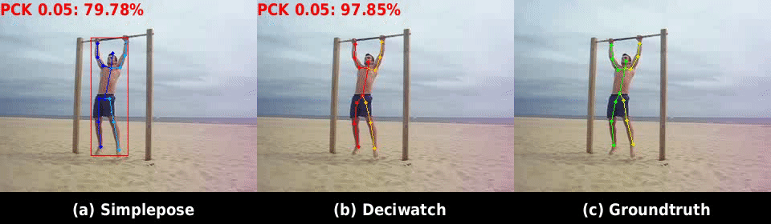

 # DeciWatch: A Simple Baseline for 10× Efficient 2D and 3D Pose Estimation (ECCV 2022)

This repo is the official implementation of "**DeciWatch: A Simple Baseline for 10× Efficient 2D and 3D Pose Estimation**". 
[[Paper]](https://arxiv.org/pdf/2203.08713.pdf)  [[Project]](https://ailingzeng.site/deciwatch)

## Update
- [x] Add failure cases and more analyses in [project page](https://ailingzeng.site/deciwatch)
- [x] Provide different sample interval checkpoints

- [x] Support DeciWatch in [MMHuman3D](https://github.com/open-mmlab/mmhuman3d) [Release v0.7.0](https://github.com/open-mmlab/mmhuman3d/releases/tag/v0.7.0) as a 10x speed up strategy!

- [x] Clean version is released! 
It currently includes **code, data, log and models** for the following tasks: 
-  2D human pose estimation
- 3D human pose estimation
- Body recovery via a SMPL model

## TODO
- [ ] Support DeciWatch in [MMPose](https://github.com/open-mmlab/mmpose)


## Description

This paper proposes a simple baseline framework for video-based 2D/3D human pose estimation that can achieve 10 times efficiency improvement over existing works without any performance degradation, named DeciWatch. Unlike current solutions that estimate each frame in a video, DeciWatch introduces a simple yet effective sample-denoise-recover framework that only watches sparsely sampled frames, taking advantage of the continuity of human motions and the lightweight pose representation. Specifically, DeciWatch uniformly samples less than 10% video frames for detailed estimation, denoises the estimated 2D/3D poses with an efficient Transformer architecture, and then accurately recovers the rest of the frames using another Transformer-based network. Comprehensive experimental results on three video-based human pose estimation, body mesh recovery tasks and efficient labeling in videos with four datasets validate the efficiency and effectiveness of DeciWatch.

### Major Features

- Model training and evaluation for **2D pose, 3D pose, and SMPL body representation**
- Supporting **four popular datasets** ([Human3.6M](http://vision.imar.ro/human3.6m/description.php), [3DPW](https://virtualhumans.mpi-inf.mpg.de/3DPW/), [AIST++](https://google.github.io/aistplusplus_dataset/factsfigures.html), [Sub-JHMDB](http://jhmdb.is.tue.mpg.de/)) and providing cleaned data of **five popular pose estimation backbones**([FCN](https://github.com/una-dinosauria/3d-pose-baseline), [SPIN](https://github.com/nkolot/SPIN), [EFT](https://github.com/facebookresearch/eft), [PARE](https://pare.is.tue.mpg.de/), [SimplePose](https://github.com/microsoft/human-pose-estimation.pytorch))
- Versatile visualization toolbox with comparision of **input (backbone estimator results) and output(DeciWatch results)**

**Visualize 2D poses on Sub-JHMDB dataset:**
 

**Visualize 3D poses on AIST++ dataset:**
 

**Visualize SMPL on 3DPW dataset:**
 


## Getting Started

### Environment Requirement

DeciWatch has been implemented and tested on Pytorch 1.10.1 with python >= 3.6. It supports both GPU and CPU inference. 

Clone the repo:
```bash
git clone https://github.com/cure-lab/DeciWatch.git
```

We recommend you install the requirements using `conda`:
```bash
# conda
source scripts/install_conda.sh
```

### Prepare Data

All the data used in our experiment can be downloaded here. 

[Google Drive](https://drive.google.com/drive/folders/1e5wEPWFNldihU5mBUpTOuQaGjgIxujrt?usp=sharing)

[Baidu Netdisk](https://pan.baidu.com/s/1ZBgQDJElkObHBhLsWtmkQw?pwd=cqcw)

Valid data includes:

| Dataset | Pose Estimator | 3D Pose | 2D Pose | SMPL |
|  ----  | ----  | ----  | ----  | ----  |
| [Sub-JHMDB](http://jhmdb.is.tue.mpg.de/)  | [SimplePose](https://github.com/microsoft/human-pose-estimation.pytorch) |   | ✔ |   |
| [3DPW](https://virtualhumans.mpi-inf.mpg.de/3DPW/)  | [EFT](https://github.com/facebookresearch/eft) | ✔ |   |  ✔ |
| [3DPW](https://virtualhumans.mpi-inf.mpg.de/3DPW/)  | [PARE](https://pare.is.tue.mpg.de/) | ✔ |   | ✔ |
| [3DPW](https://virtualhumans.mpi-inf.mpg.de/3DPW/)  | [SPIN](https://github.com/nkolot/SPIN) | ✔ |   | ✔ |
| [Human3.6M](http://vision.imar.ro/human3.6m/description.php)  | [FCN](https://github.com/una-dinosauria/3d-pose-baseline) | ✔ |   |   |
| [AIST++](https://google.github.io/aistplusplus_dataset/factsfigures.html)  | [SPIN](https://github.com/nkolot/SPIN) | ✔ |   | ✔ |

Please refer to [doc/data.md](doc/data.md) for detailed data information and data preparing.

### Training

Note that the training and testing datasets should be downloaded and prepared before training.

You may refer to [doc/training.md](./doc/training.md) for more training details.

Run the commands below to start training:

```shell script
python train.py --cfg [config file] --dataset_name [dataset name] --estimator [backbone estimator you use] --body_representation [smpl/3D/2D] --sample_interval [sample interval N]
```

For example, you can train on **3D position representation** of the **3DPW dataset** using the **backbone estimator SPIN** with a sample interval **N=10** (sampling ratio=10%) by:

```shell script
python train.py --cfg configs/config_pw3d_spin.yaml --dataset_name pw3d --estimator spin --body_representation 3D --sample_interval 10
```


### Evaluation (Take a 10% sampling ratio as an example)

Noted that although our main contribution is the high efficiency improvement, using DeciWatch as post processing is also helpful for accuracy and smoothness improvement.

You may refer to [doc/evaluate.md](./doc/evaluate.md) for evaluate details on all sampling ratios.


**Results on 2D Pose:**

| Dataset | Estimator | PCK 0.05 (Input/Output):arrow_up: | PCK 0.1 (Input/Output):arrow_up: | PCK 0.2 (Input/Output):arrow_up: | Checkpoint |
| ------- | --------- | -------------------- | ------------------ | ------------- |------------- |
| Sub-JHMDB   | simplepose      | 57.30%/79.44% |81.61%/94.05%              | 93.94%/98.75% |[Baidu Netdisk](https://pan.baidu.com/s/1W_9xEyJ9Y7zlBOt5fYpEWQ?pwd=rehu) / [Google Drive](https://drive.google.com/drive/folders/1Wd4MxpxLmqoTMB8AlnnMY4Vb641dp2Tw?usp=sharing)|


**Results on 3D Pose:**

| Dataset | Estimator | MPJPE (Input/Output):arrow_down: | Accel (Input/Output):arrow_down: | Checkpoint |
| ------- | --------- | ------------------ | ------------------ | -------- |
| 3DPW    | SPIN      | 96.92/93.34            | 34.68/7.06            |[Baidu Netdisk](https://pan.baidu.com/s/1Kj70V107nGBH7142onXODQ?pwd=9p4o) / [Google Drive](https://drive.google.com/drive/folders/1lj93zsJj3_InTFGWpyNNZ_R7gRQSZE4P?usp=sharing)|
| 3DPW    | EFT       | 90.34/89.02              | 32.83/6.84            | [Baidu Netdisk](https://pan.baidu.com/s/1d5Ib-IgWVPRbjUOf9LFXug?pwd=w3v2) / [Google Drive](https://drive.google.com/drive/folders/17xO_X213hcNEEtJbJlz8qE2aCB3-gncH?usp=sharing) |
| 3DPW    | PARE       | 78.98/77.16              | 25.75/6.90            |[Baidu Netdisk](https://pan.baidu.com/s/1gePXz93tT74GQbfmSStg4Q?pwd=ug8m) / [Google Drive](https://drive.google.com/drive/folders/19E-5lfPHRUelIc2vgdu-M_CEatdFNul_?usp=sharing) |
| AIST++    | SPIN       |  107.26/71.27           | 33.37/5.68         |    [Baidu Netdisk](https://pan.baidu.com/s/1X2KvDirfq5lIE9yrlbIbqg?pwd=5jpi) / [Google Drive](https://drive.google.com/drive/folders/17JNAyJqHx577oP4fWFUQHQIjIjFUuf6v?usp=sharing) |        
| Human3.6M    | FCN       | 54.56/52.83              | 19.18/1.47           | [Baidu Netdisk](https://pan.baidu.com/s/1B_yLjyzNVNlE4fQOHuLTFQ?pwd=gdek) / [Google Drive](https://drive.google.com/drive/folders/1LblRGrXeVnW3jDwgYD9hj-ladhnumCrW?usp=sharing) |

**Results on SMPL-based Body Recovery:**

| Dataset | Estimator | MPJPE (Input/Output):arrow_down:| Accel (Input/Output):arrow_down:| MPVPE (Input/Output):arrow_down: | Checkpoint |
| ------- | --------- | ------------------ | ------------------ | ------------------ | ------ |
| 3DPW    | SPIN      | 100.13/97.53             | 35.53/8.38            | 114.39/112.84            | [Baidu Netdisk](https://pan.baidu.com/s/1obQaCp6yjdkMQr2FRF3Y2A?pwd=b8ur) / [Google Drive](https://drive.google.com/drive/folders/1j7pYCOvvzBBcpu7G_S5-GOXenSXaDeZl?usp=sharing) |
| 3DPW    | EFT       | 91.60/92.56              | 33.57/8.75           | 110.34/109.27            |[Baidu Netdisk](https://pan.baidu.com/s/1SP9EPwd_S0MPiyTfWGLgUg?pwd=8lfn) / [Google Drive](https://drive.google.com/drive/folders/1P_LObi8Tr09lw8149Pqe4Ks2SOK-RvYN?usp=sharing)|
| 3DPW    | PARE       | 80.44/81.76                |  26.77/7.24            |94.88/95.68           | [Baidu Netdisk](https://pan.baidu.com/s/1Leo2O1FHoumk0lMaX9AFhQ?pwd=7504) / [Google Drive](https://drive.google.com/drive/folders/1m7IeojeAN9_WBTCwv8921RgOX1SPn7P4?usp=sharing) |
| AIST++    | SPIN       | 108.25/82.10              | 33.83/7.27         | 137.51/106.08            |   [Baidu Netdisk](https://pan.baidu.com/s/1EwiR3AyMP8tnSYgU1VY1Tg?pwd=7p4f) / [Google Drive](https://drive.google.com/drive/folders/1X8N1XU2IN3DMSEE5u36Ca8nkuKEul5hj?usp=sharing) |


### Quick Demo

Here, we only provide demo visualization based on off-line processed detected poses of specific datasets. To visualize on arbitrary given video, please refer to [MMHuman3D](https://github.com/open-mmlab/mmhuman3d).

Run the commands below to visualize demo:

```shell script
python demo.py --cfg [config file] --dataset_name [dataset name] --estimator [backbone estimator you use] --body_representation [smpl/3D/2D] --sample_interval [sample interval N]
```

You are supposed to put corresponding images with the data structure:

```
|-- data
    |-- videos
        |-- pw3d 
            |-- downtown_enterShop_00
                |-- image_00000.jpg
                |-- ...
            |-- ...
        |-- jhmdb
            |-- catch
            |-- ...
        |-- aist
            |-- gWA_sFM_c01_d27_mWA2_ch21.mp4
            |-- ...
        |-- ...
```

For example, you can visualize results of **3D position representation** on the **3DPW dataset** using the **backbone estimator SPIN** with a sample interval **N=10** (sampling ratio=10%) by:

```shell script
python demo.py --cfg configs/config_pw3d_spin.yaml --dataset_name pw3d --estimator spin --body_representation 3D --sample_interval 10
```

Please refer to the dataset website for the raw images. You may change the config in [lib/core/config.py](lib/core/config.py) for different visualization parameters.

You can refer to [doc/visualize.md](./doc/visualize.md) for visualization details.


## Citing DeciWatch

If you find this repository useful for your work, please consider citing it as follows:

```bibtex
@inproceedings{zeng2022deciwatch,
  title={DeciWatch: A Simple Baseline for 10x Efficient 2D and 3D Pose Estimation},
  author={Zeng, Ailing and Ju, Xuan and Yang, Lei and Gao, Ruiyuan and Zhu, Xizhou and Dai, Bo and Xu, Qiang},
  booktitle={European Conference on Computer Vision},
  year={2022},
  organization={Springer}
}
```

Please remember to cite all the datasets and backbone estimators if you use them in your experiments.


## Acknowledgement

Many thanks to [Xuan Ju](https://cure-lab.github.io/people/xuan_ju/index.html) for her great efforts to clean almost the original code!!!


## License
This code is available for **non-commercial scientific research purposes** as defined in the [LICENSE file](./LICENSE). By downloading and using this code you agree to the terms in the [LICENSE](./LICENSE). Third-party datasets and software are subject to their respective licenses.
