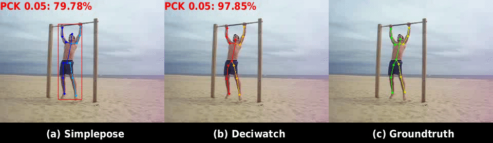

# Visualization Detail

Visualization configs are explained in [lib/core/config.py](../lib/core/config.py). Different configs for different datasets and estimators are in [config](../configs/) folder.

## Visualization Commands & Results

You can directly visualize the results in different datasets and estimator settings using following commands


### 2D Pose
Sub-JHMDB Simplepose
```shell script
python demo.py --cfg configs/config_jhmdb_simplepose_2D.yaml --dataset_name jhmdb --estimator simplepose --body_representation 2D --sample_interval 10

```




### 3D Pose
3DPW SPIN
```shell script
python demo.py --cfg configs/config_pw3d_spin_3D.yaml --dataset_name pw3d --estimator spin --body_representation 3D --sample_interval 10

```
3DPW EFT
```shell script
python demo.py --cfg configs/config_pw3d_eft_3D.yaml --dataset_name pw3d --estimator eft --body_representation 3D --sample_interval 10

```
3DPW PARE
```shell script
python demo.py --cfg configs/config_pw3d_pare_3D.yaml --dataset_name pw3d --estimator pare --body_representation 3D --sample_interval 10

```
AIST++ SPIN
```shell script
python demo.py --cfg configs/config_aist_spin_3D.yaml --dataset_name aist --estimator spin --body_representation 3D --sample_interval 10

```
Human3.6M FCN
```shell script
python demo.py --cfg configs/config_h36m_fcn_3D.yaml --dataset_name h36m --estimator fcn --body_representation 3D --sample_interval 10

```


### SMPL
3DPW SPIN
```shell script
python demo.py --cfg configs/config_pw3d_spin_smpl.yaml --dataset_name pw3d --estimator spin --body_representation smpl --sample_interval 10

```
3DPW EFT
```shell script
python demo.py --cfg configs/config_pw3d_eft_smpl.yaml --dataset_name pw3d --estimator eft --body_representation smpl --sample_interval 10

```
3DPW PARE
```shell script
python demo.py --cfg configs/config_pw3d_pare_smpl.yaml --dataset_name pw3d --estimator pare --body_representation smpl --sample_interval 10

```
AIST++ SPIN
```shell script
python demo.py --cfg configs/config_aist_spin_smpl.yaml --dataset_name aist --estimator spin --body_representation smpl --sample_interval 10

```


## Useful configs

- Set ```cfg.VIS.INPUT_VIDEO_NUMBER = [visualization video number]```, then you can visualize different sequence in the dataset

- Set ```cfg.VIS.START = [start frame]``` and ```cfg.VIS.END = [end frame]```, then you can visualize from start frame to end frame
